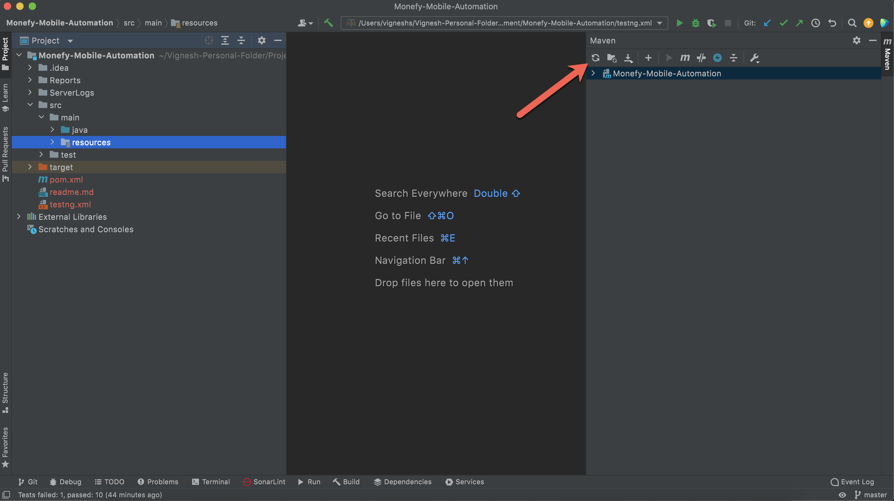
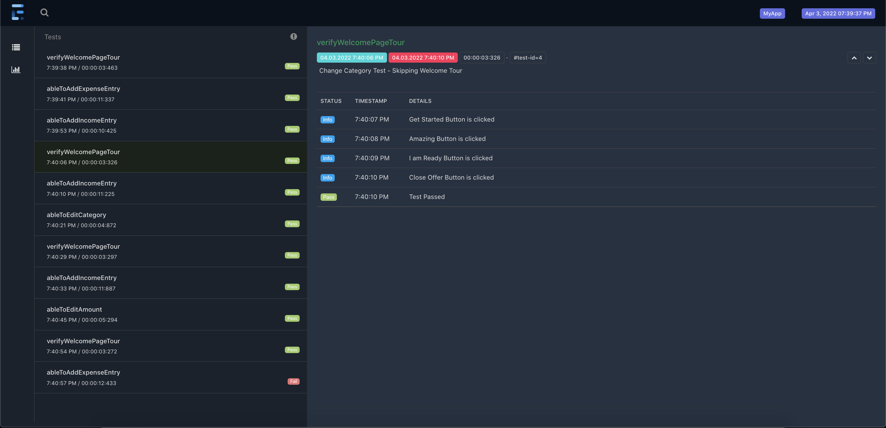

# Monefy App Android Automation

This is  **Appium-Java** automation repository for the **Monefy Android App**. Below have mentioned all the prerequisite and installation to run this tests.

### Please refer to the video under  folder "Video/Execution-Video.mp4"to understand how the test executes and how the report is displayed

## Prerequisite

- Java need to be installed and environment variables need to be set.
- Appium server need to be installed
- Android Emulator need to be installed along with "Monefy" application from playstore

## Maven Dependency download

- Once the repo is downloaded & opened in the IDE → To install all the dependencies mentioned in the pom.xml type the following

> mvn dependency:resolve

- Or other easy way is to click on the "Reload all maven project" button near to maven side bar in the IntelliJ as shown in the below image 

## To run Test and view Reports
- Added 4 tests → Three HappyPath tests and one negative test(To display the failed screenshot in report)
- Right-click on the **testng.xml** and click on **Run../testng.xml**
- Once the test execution is completed open report from folder **Reports/ExtentReport.html**    
  

## Project Folder Structure
Used Maven Project for this automation. Below its the folder structure and each file usage to the framework

### Under project root
- Reports → This folder holds the report generated post the test execution.
- ServerLogs  → This folder holds the appium Log generated during the test execution.
- Video → This folder holds the **Execution Video**
- testng.xml → This xml file helps to run all the test mentioned in the xml format

### Under src/main/java
- BasePage → Use to hold common method used used across all pages. Every Page should extend this BasePage
-  BaseTest → As the name suggest, this is the base test to all the tests. It helps to Start & Stop Appium Server and Start & TearDown Driver. All tests should extend this Base Test
- FrameworkConstants → Use to hold constants used across framework
- Driver → To initiate and quit driver during test execution
- Driver Manager → To manage Driver instance to support **parallel execution**
- Driver Factory → To hold the logic of what driver to launch based on desired capabilities
- Listener → A class which is being listened by testng.xml which helps to trigger various action based on Test Start, Test End, Test Fails etc
- Pages → Hold different page classes. Each class contains locators and method oriented to that class
- Extent Report → To initiate and quit driver Extent Report during test execution
- Utils → As the name suggest used to hold classes which are utilities to the framework such as utility class for Reading Property file, Scrolling, AppInteractions, Starting/Stopping Appium Server

### Under src/test/java
- AddExpenseAndIncomeEntryTest → To test & verify if Expense & Income Entry can be made.
- ChangeAmountTest → To test & verify if the amount can be edited for the existing entry.
- ChangeCategoryTest → To test & verify if the category can be edited for the existing entry.
- NegativeTest → A Negative test to check if the amount does not match. Wrote it to demonstrate how the **Failure Screenshot** appears in the **Report**

### Under src/test/resources
- app → Hold the apk file of the application
- Config.properties → Hold the important configuration such as platformName, platformVersion, appiumUrl etc