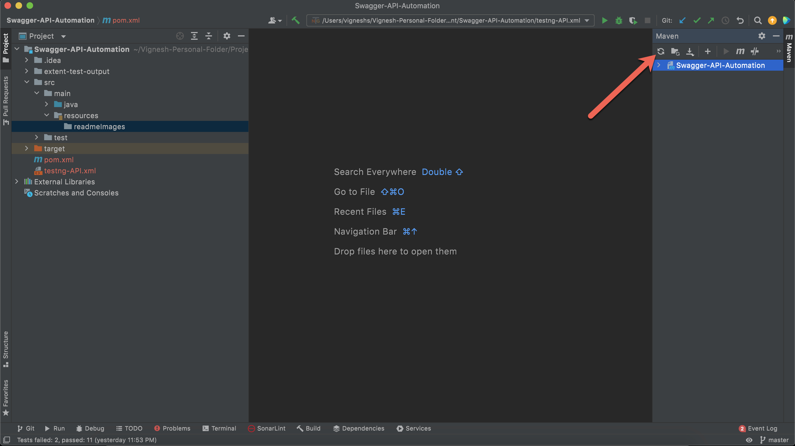
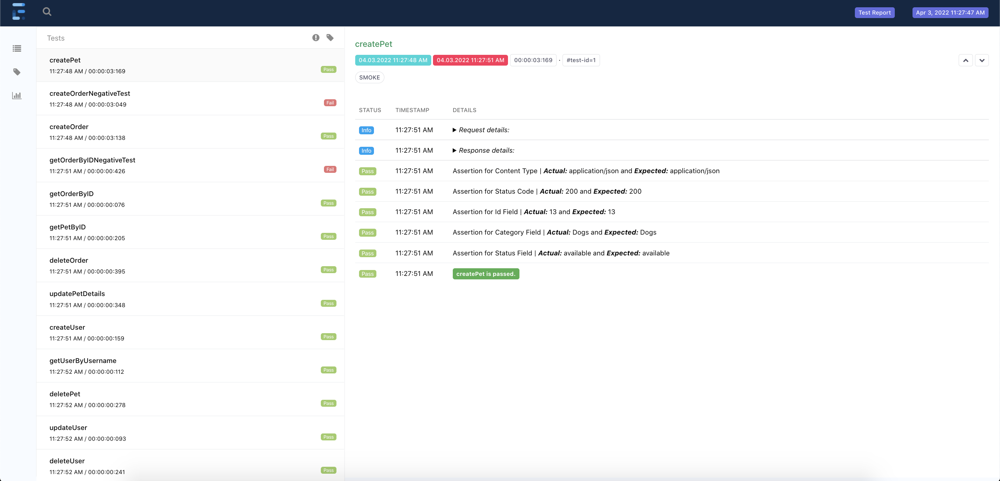

# Swagger API Automation

This is  **RestAssured-Java**  automation repository for the Swagger Pet Project. Below have mentioned all the prerequisite and installation to run this tests.

## Prerequisite

-   Java need to be installed and environment variables need to be set. To check if Java is installed correctly, in terminal or Command prompt type the following

> java -version

It should give output as similar to following (Based on the Java Version Installed)

```
java version "1.8.0_241"
Java(TM) SE Runtime Environment (build 1.8.0_241-b07)
Java HotSpot(TM) 64-Bit Server VM (build 25.241-b07, mixed mode)

```

- Any IDE should be installed such as Eclipse, IntelliJ etc
- Clone the Swagger Pet Project repo(https://github.com/swagger-api/swagger-petstore) and run the following command to start the API in **localhost:8080**
```
mvn package jetty:run

```

## Maven Dependency download

-   Once the repo is downloaded & opened in the IDE → To install all the dependencies mentioned in the pom.xml type the following

> mvn dependency:resolve

-   Or other easy way is to click on the "Reload all maven project" button near to maven side bar in the IntelliJ as shown in the below image 

## To run Test and view Reports
- Added 4 tests → Three Happy Path test and one negative test
- Right-click on the **testng.xml** and click on **Run../testng.xml**
- It will run all the tests in parallel as per class level. Once the test execution is completed it will automatically open the report in the default browser as below
  

## Project Folder Structure
Used Maven Project for this automation. Below its the folder structure and each file usage to the framework

### Under project root
- extent-test-output → This folder holds the report generated post the test execution.
- testng.xml → This xml file helps to run all the test mentioned in the xml format

### Under src/main/java/framework Package
This package holds the content which is common for entire framework. Splitting  components in framework level helps us to integrate single framework for multiple projects.

- FrameworkAnnotation → Used to create customised Annotation
- RestResource → Used to hold common methods such as Get, Post, Put etc
- Route → Used to hold constants of the path used in API URL Creation
- SpecBuilder → Used to create Request and Response Specification
- ApiBaseTest →  As the name suggest, this is the base test to all the tests. It helps to initiate Listener to tests. All tests should extend this Base Test
- FrameworkConstants → Used to hold constants used across framework
- ENUM - Category Types → To hold Category Type Enums to display in the Report
- ENUM - Config Properties → To hold Config Property Enums corresponding the config.properties file
- ENUM - ContentType → To hold Content Type Enums
- ENUM - StatusCode → To hold different Status Code Enums
- Customised Exceptions → To create & use different types of customised exceptions to use in the framework
- Listener → General Listener which is being listened by ApiBaseTest which helps to trigger various action based on Test Start, Test End, Test Fails etc
- Extent Logger → Used to log the data in the Report based on if test pass/fail/skip
- Extent Manager → To manage Extent Test instance to support **parallel execution** similar to Driver Manager
- Extent Report → To initiate and quit Extent Report during test execution
- Utils → As the name suggest used to hold classes which are utilities to the framework such as utility class for ApiVerificationManager, PropertyUtils etc

### Under src/main/java/project Package

This package holds the content which is specific to project such as application API and POJO for all API.

- pet → Contains API related to Pet feature such as CreatePet, GetPet, UpdatePet & DeletePet
- store → Contains API related to Store feature such as CreateOrder, GetOrder & DeleteOrder
- user → Contains API related to User feature such as CreateUser, GetUser, UpdateUser & DeleteUser
- request Pojo's → Contains POJO's for all Request
- response Pojo's → Contains POJO's for all Response


### Under src/test/java Package
- PetTest → Happy path test, which create a pet, get pet details by id, update pet details and delete the pet.
- StoreTest → Happy path test, which create an Order, get Order details by id, delete Order.
- UserTest → Happy path test, which create a user, get user details by username, update user details and delete the user.
- NegativeTest → A Negative test to check if the Status Code does not match. Wrote it to demonstrate how the **Test Failure Details** appears in the **Report**

### Under src/main/resources Package
- Config.properties → Hold the important configuration. All these values are easily editable

All the test runs in parallel as per class level as **parallel="classes"** has been declared in **testng.xml**